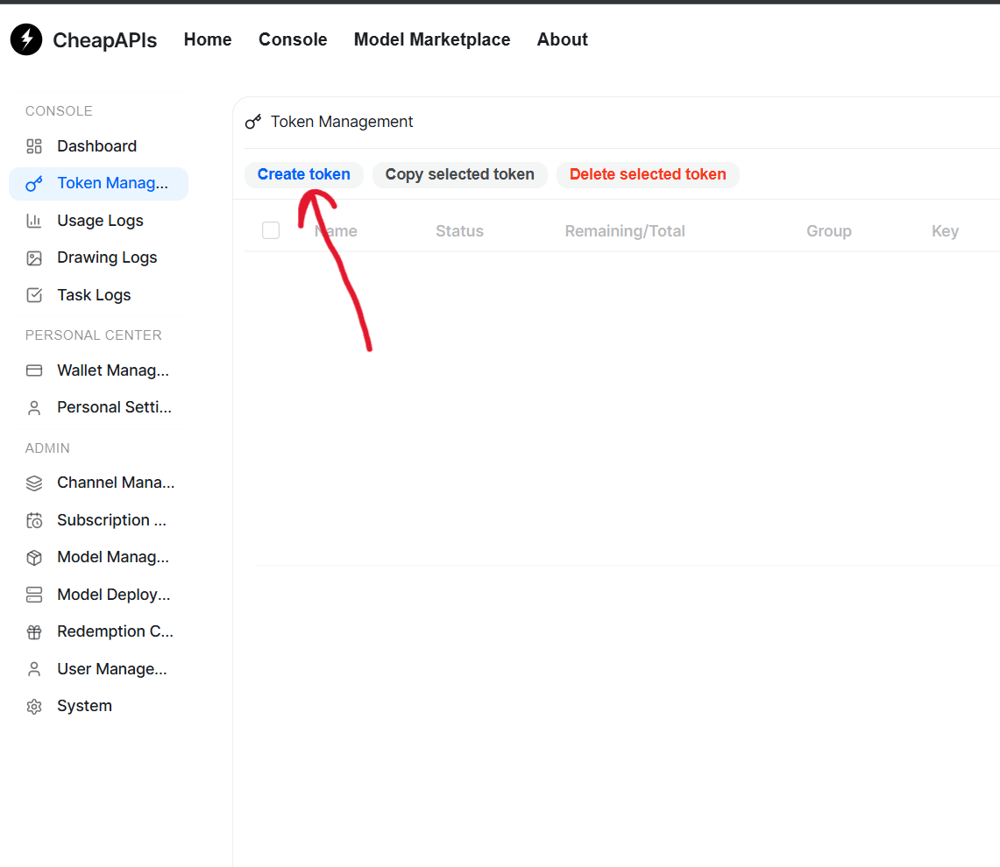
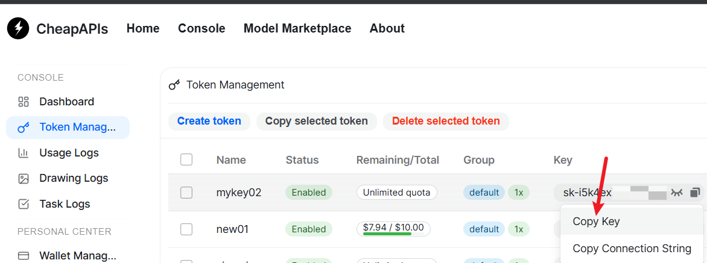

# How to Get an API Key

This tutorial explains how to create and copy an API key in the console. In the console UI, a **Token** is an API key. You can use it to call the API from clients, scripts, or third-party applications. The OpenAI-compatible Base URL is `https://cheapapis.net/v1`.

> Keep your API key secure. Do not commit it to a Git repository, share it in public chat logs, or include it directly in frontend code.

## 1. Open Token Management

After signing in to the console, click **Token Management** in the left navigation bar to open the API key management page.


## 2. Create a New API Key

On the Token Management page, click **Create token** in the upper-right corner.



## 3. Configure the Token

On the creation page, enter and confirm the following settings:

- **Name**: Enter an easily identifiable name, such as `my-app-production` or `local-development`.
- **Token Group**: Select `default`.
- **Expiration Date**: Leave this setting unchanged.
- **Remaining Quota**: Optionally limit the quota available to this API key to prevent a single key from unexpectedly consuming too much quota.

The name and token group are generally required. Configure the remaining settings according to your use case.


## 4. Submit the Request

After confirming that the settings are correct, click **Submit** at the bottom of the page to create the API key.


## 5. Copy the API Key

After the token is created, return to the Token Management list. Open the action menu for the target token and select **Copy Key** to copy the API key.



Store your API key in a password manager or a server-side environment variable. For example:

```bash
export OPENAI_API_KEY="your-api-key"
```

You can now configure this API key in any client, SDK, or application that supports the OpenAI-compatible API. If you suspect that the key has been exposed, immediately disable or delete the token in Token Management and create a new API key. The OpenAI-compatible Base URL is `https://cheapapis.net/v1`.
